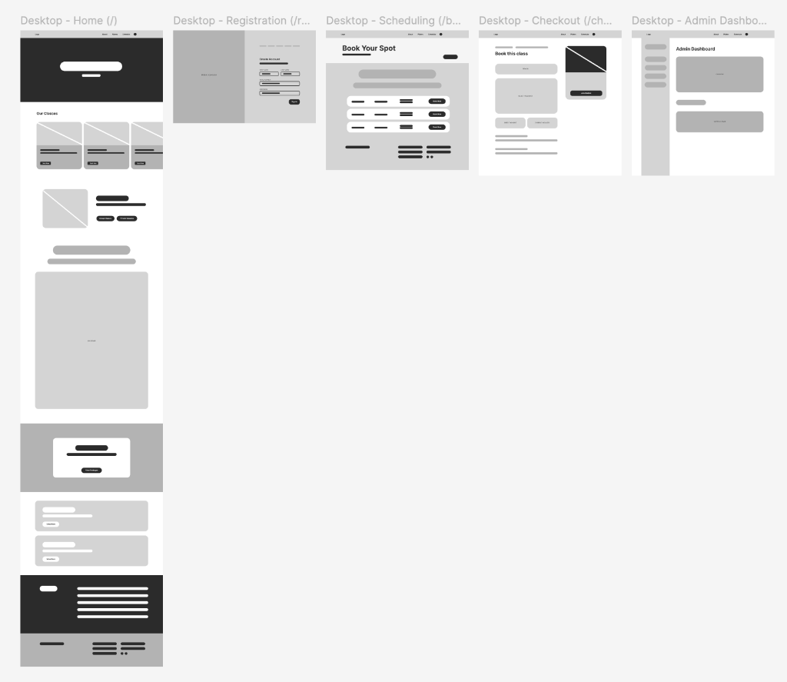
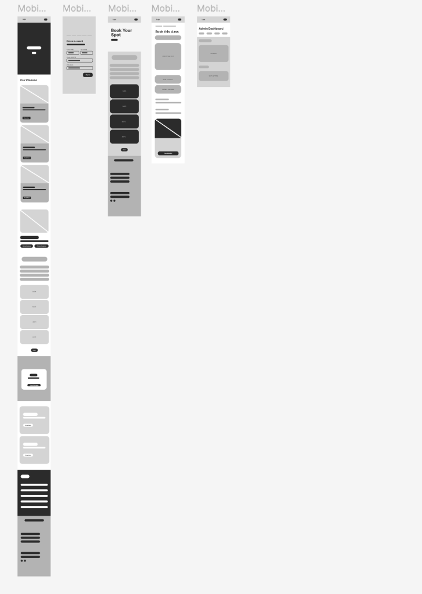
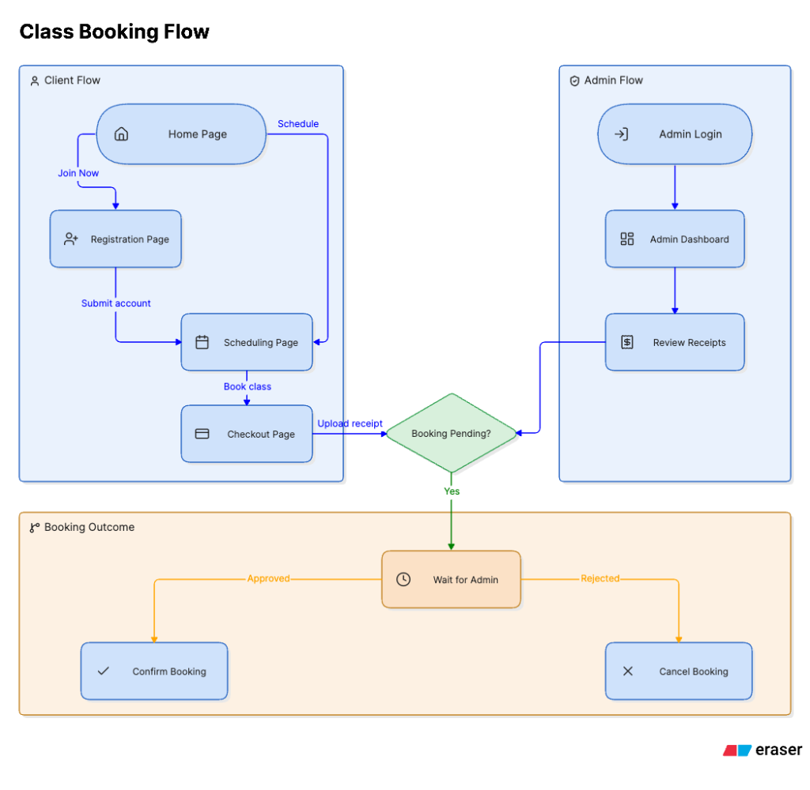

# Mockup

The prelim wireframes (M6A2), with the finished app alongside, so the plan and
the result can be compared screen by screen.

## Wireframes

Desktop: Home, Registration, Scheduling, Checkout, Admin Dashboard.

Mobile: the same five screens.

How a client and the admin move through them:

## The built app

Live: https://revive-pilates-studio-6b8h.vercel.app

The full painted design, with real colours, type and content on every screen,
is in the presentation: [revive-pilates-presentation.pdf](revive-pilates-presentation.pdf).

## Honest note

The Registration screen in the wireframes was not built. Signing in with an
emailed link creates the account instead, so `/register` now redirects to
`/login`. The reason is recorded in [01-proposal.md](01-proposal.md).
