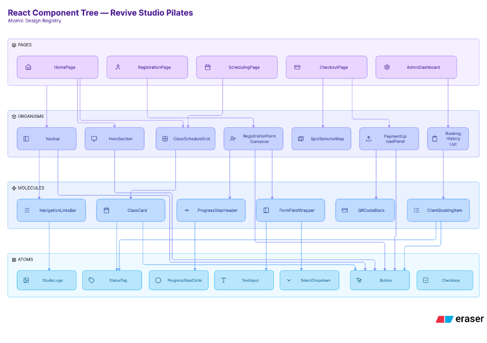

# Design system

The rules the interface follows, from M6A3. The visual version (swatches, type
samples, component sheets) was submitted as Figma PDF exports.

## Colour

| Token | Role | Hex |
| --- | --- | --- |
| `--color-brand-brown` / `--color-primary` | Links, buttons, active states | `#5C4A42` |
| `--color-brand-sand` / `--color-accent` | Highlights, borders | `#D9CBB8` |
| `--color-brand-beige` / `--color-bg` | Page background | `#F5F1EB` |
| `--color-surface` | Cards, panels, modals | `#FAFAFA` |
| `--color-brand-dark` / `--color-text` | Body text, headings | `#2A2522` |

Contrast: `#2A2522` on `#F5F1EB` and on `#FAFAFA` both exceed 4.5 to 1.

## Type

| Name | Family | Size | In code | Use |
| --- | --- | --- | --- | --- |
| Heading | Playfair Display | 64px | `--text-heading` | Page headings |
| Sub-heading | Playfair Display | 32px | Tailwind `text-3xl` range | Section titles |
| Card title | Inter | 24px | Tailwind `text-2xl` | Class cards, dashboard items |
| Body | Inter | 20px | `--text-base` | Paragraphs, labels |
| Small | Inter | 16px | `--text-sm` | Captions, helper text, footer |

Only the three sizes used everywhere are tokens; the two in between use
Tailwind's own size classes.

## Spacing

| Name | Size | Use |
| --- | --- | --- |
| Tight | 8px (`gap-2`) | Related inputs and icons |
| Standard | 16px (`--spacing-base`) | Card padding, between sections |
| Screen edge | 32px (`px-8`) | Side padding on phones |

## Components

Built with atomic design. The plan:

What exists in `client/src/components/`:

- **Atoms:** `CustomDropdown`
- **Organisms:** `Navbar`, `Footer`, `ClassScheduleGrid`, `BookYourSpotSchedule`,
  `SpotSelectorMap`, `PaymentUploadPanel`, `MoveBookingDialog`, the home page
  sections, and the admin panels (`AdminClassRoster`, `AdminCoaches`,
  `AdminClientProfile`, `AdminStudioSettings`)

In practice most pieces grew into organisms: the schedule grid, for example,
owns its own week navigation and drag-and-drop, so the planned `ClassCard`
molecule was folded into it.

Form inputs replace the browser outline with a brown border on focus
(`focus:border-brand-brown`). Disabled buttons are dimmed and ignore clicks.
Full classes and taken spots are shown as disabled rather than hidden.

## States

- **Loading:** a short "Loading…" line in place of the content, never a blank area.
- **Empty:** a sentence saying what is missing and what to do, e.g. no
  bookings yet with a link to the schedule.
- **Error:** the API's own message in a soft red panel, with the page still usable.
- **Data:** the normal screen.

## Responsive

- **Below 768px:** schedules and cards stack in one column; the navbar
  collapses to a menu button.
- **768px and up:** grid layouts and the full navigation bar.

## In code

Tailwind CSS v4. The tokens are in the `@theme` block at the top of
`client/src/index.css`, so every Tailwind class such as `bg-brand-beige` reads
from one place.
