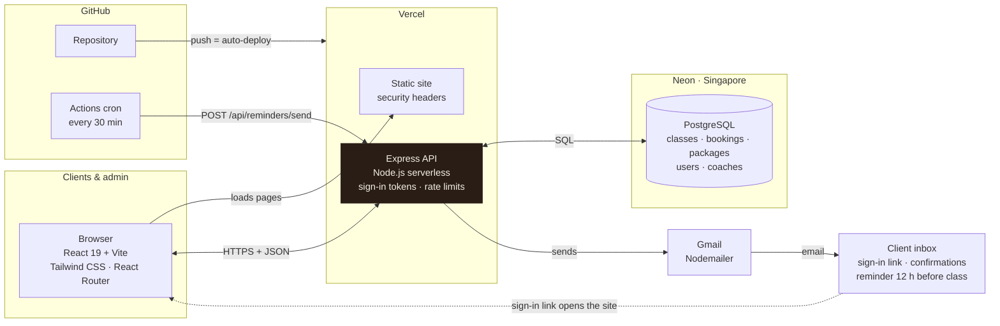
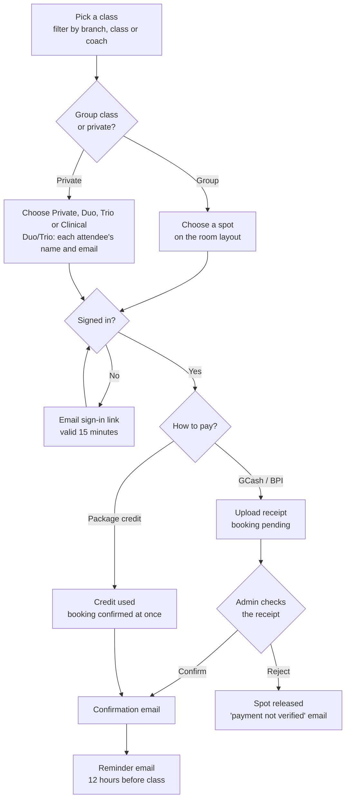

# How it's built

Two flowcharts of Revive Pilates Studio: how the parts connect, and how one
booking moves through them.

## Architecture

Every page talks to one Express API. Only the API touches the database and
sends email.

## A booking, start to finish

