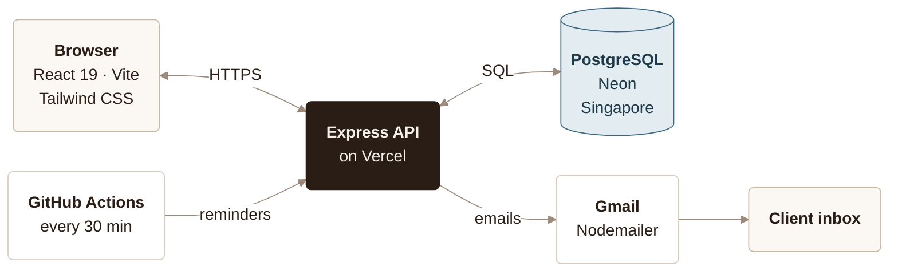
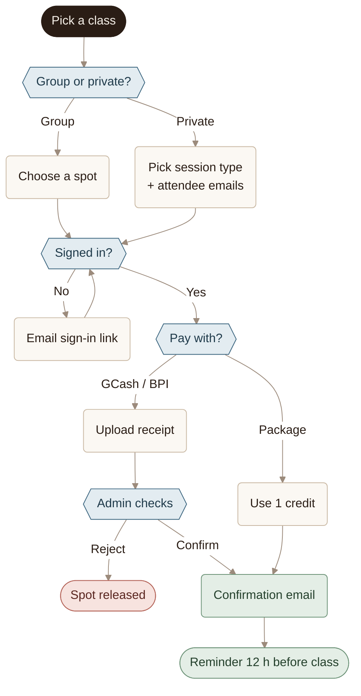

# How It's Built

Two flowcharts of Revive Pilates Studio: how the parts connect, and how one booking moves through them.

---

### 01 — ARCHITECTURE

> Every page talks to one Express API. Only the API touches the database and sends email.

| Part | Role |
| --- | --- |
| **Browser** | The site clients and the admin use, on phone or laptop |
| **Express API** | Hosted on Vercel with the website. The only part that reads the database or sends email; checks sign-in tokens and rate limits |
| **PostgreSQL** | Classes, bookings, packages, users and coaches, hosted in Singapore for speed in the Philippines |
| **Gmail** | Sign-in links (valid 15 minutes), confirmations, and reminders 12 hours before class |
| **GitHub Actions** | Calls the API every 30 minutes to send due reminders. Every push to GitHub also redeploys the site |
| **Client inbox** | The sign-in link in the email opens the site, signed in |

---

### 02 — A BOOKING, START TO FINISH

